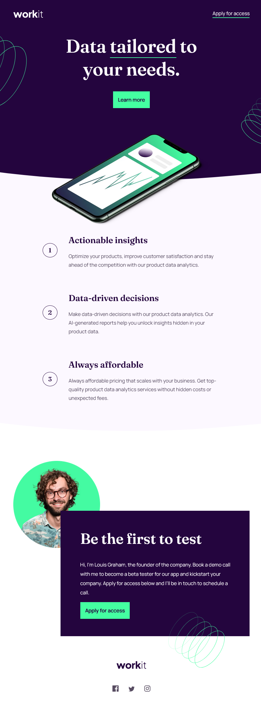
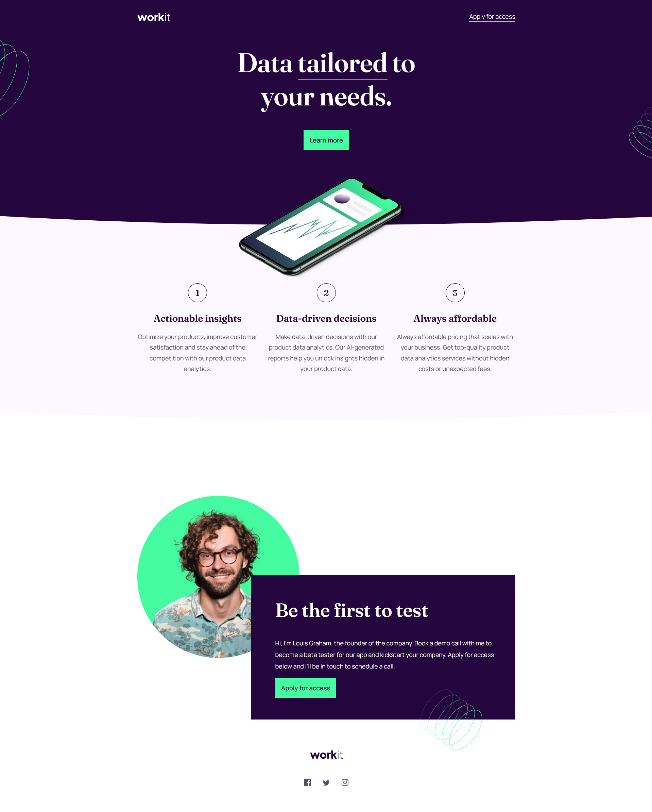

# Frontend Mentor - Workit landing page solution

This is a solution to the [Workit landing page challenge on Frontend Mentor](https://www.frontendmentor.io/challenges/workit-landing-page-2fYnyle5lu). Frontend Mentor challenges help you improve your coding skills by building realistic projects. 

## Table of contents

- [Frontend Mentor - Workit landing page solution](#frontend-mentor---workit-landing-page-solution)
  - [Table of contents](#table-of-contents)
  - [Overview](#overview)
    - [The challenge](#the-challenge)
    - [Screenshot](#screenshot)
    - [Links](#links)
  - [My process](#my-process)
    - [Built with](#built-with)
    - [Useful resources](#useful-resources)
  - [Author](#author)

## Overview

### The challenge

Users should be able to:

- View the optimal layout for the interface depending on their device's screen size
- See hover and focus states for all interactive elements on the page

### Screenshot

### Links

- Solution URL: https://www.frontendmentor.io/challenges/workit-landing-page-2fYnyle5lu/hub
- Live Site URL: https://workit-landing-page-silk.vercel.app/

## My process

### Built with

- HTML/CSS
- Flexbox
- Mobile-first workflow
- BEM naming convention
  
### Useful resources

I've never done curved sections. So, I went to Fireship and watched his video on making [curvy websites](https://www.youtube.com/watch?v=lPJVi797Uy0).

The curves I used eventually were generated from https://www.shapedivider.app/

## Author

- Frontend Mentor - [@andrew2764](https://www.frontendmentor.io/profile/andrew2764)